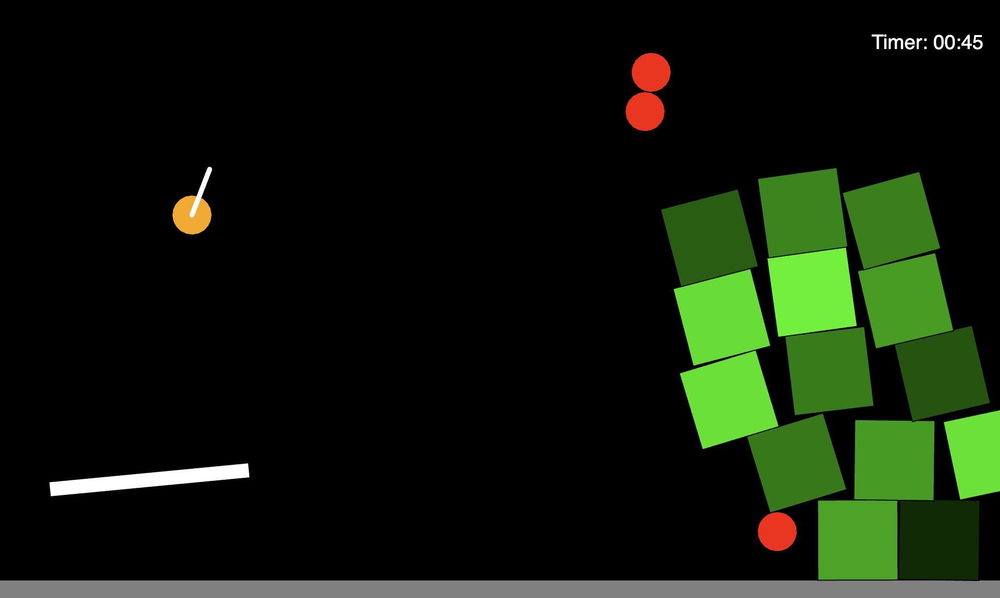

# Angry Bird

## About

This application is a simple implementation of the angry bird game created using the p5.js library. The aim of the game is to hit all of the boxes out of the screen before the time runs out. There are two ways to do so:

1. Using the slingshot: The slingshot can be used to launch the yellow ball towards the boxes. The slingshot is controlled by the mouse, and the "r" key can be pressed to place the yellow ball back on the slingshot.

2. Using the propeller: The propeller can be used to launch the red balls towards the boxes. The propeller is controlled by the left and right arrow keys, and the "b" key can be pressed to spawn a red ball at the position of the cursor.